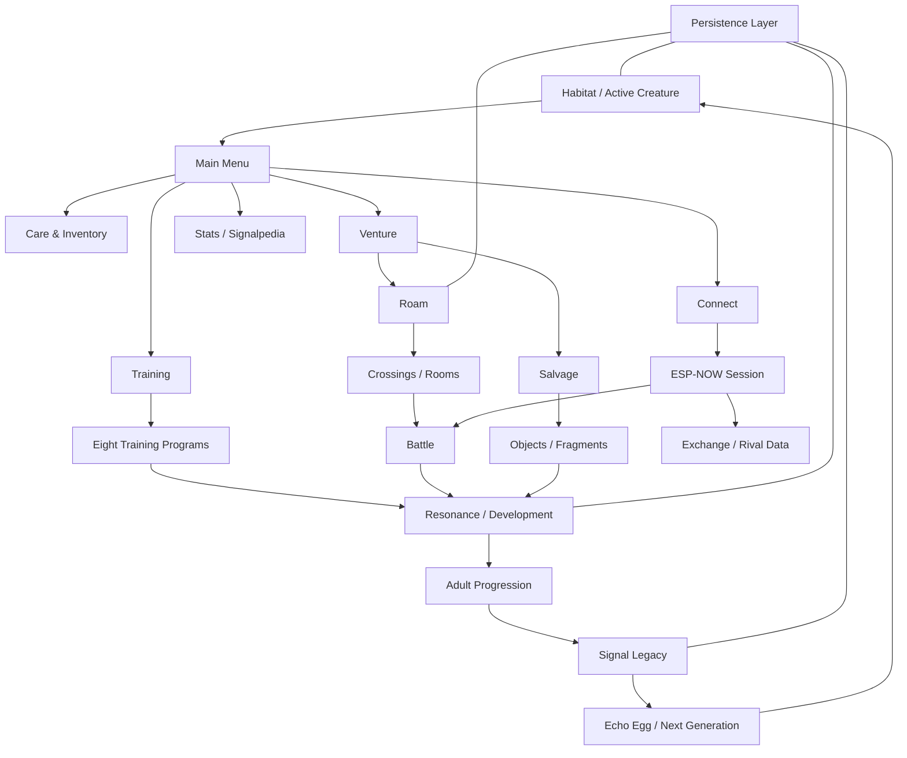

# Demonym

**Demonym** is an embedded virtual-creature game for ESP32 devices, originally designed for the **M5Stack Cardputer ADV**.

Raise a persistent organism, train it through arcade-style programs, explore procedural Roam spaces, recover strange objects and Fragments, fight solo or against another physical device over ESP-NOW, and eventually pass part of a creature's identity into a new generation.

> **Current project milestone:** v0.9.22 — Balance + Content Lock  
> **Primary hardware:** M5Stack Cardputer ADV  
> **Language:** C++17  
> **Framework:** Arduino / PlatformIO  
> **Status:** Late alpha / content lock

Demonym's complete production source is maintained privately. This public repository is a **technical showcase and firmware release home** containing player documentation, architecture notes, selected production-derived utilities, simplified engineering examples, and public tests. See [Repository Scope](REPOSITORY_SCOPE.md).

## Quick links

- [Player Manual](player_manual.md) — controls, systems, progression, lore, and terminology
- [Firmware Releases](https://github.com/eyeofbri/Demonym/releases) — downloadable Cardputer ADV builds
- [Supported Hardware](SUPPORTED_HARDWARE.md) — current and future device targets
- [Architecture](docs/architecture.md) — how the major systems fit together
- [Engineering & Testing](docs/development-and-testing.md) — validation strategy and physical-device QA
- [Selected Examples](examples/README.md) — small public code samples

## What is Demonym?

Demonym began as a deterministic procedural sprite experiment and grew into a persistent embedded game with a full creature lifecycle and a collection of interacting systems:

- **Egg → Juvenile → Adult lifecycle** with persistent identity and development
- **Eight procedural Lineages:** Husk, Mire, Wisp, Fang, Choir, Machine, Cinder, and Veil
- **Procedural 32×32 creature sprites** driven by seed, lineage, form, history, and inherited traits
- **Care simulation** for Health, Energy, Hunger, Stress, sleep, food, medicine, and Habitat upkeep
- **Eight Training programs** with independent difficulty and persistent records
- **Procedural Roam** with Depths, room archetypes, Crossings, navigation tools, extraction, merchants, and Salvage
- **Turn-based battle system** with moves, Guard, Retreat, Pressures, statuses, Adaptations, XP, and injury
- **ESP-NOW multiplayer** between physical devices for battles, exchanges, rival details, reactions, and lightweight chat
- **Signalpedia** discovery tracking and field notes
- **Signal Legacy** and Echo Eggs for restrained generational inheritance
- **Hybrid persistence** designed around recoverability, versioning, and constrained embedded storage

## System overview



## Engineering highlights

### Deterministic procedural creatures

A creature is not stored as a bitmap. Its appearance is reconstructed from persistent identity data. The production generator combines seeded randomness, lineage-specific body plans, life-stage/form modifiers, cleanup and validation passes, palettes, facial features, and reversible history markings.

The result is repeatable: the same compatible identity produces the same creature after a reboot while still allowing later events to leave visible traces.

Read: [Creature Generation](docs/creature-generation.md)

### Embedded persistence built for failure

Demonym's save system evolved substantially during hardware testing. The active creature uses redundant authenticated checkpoints, while larger history-oriented records can use SD-backed storage with verified fallback behavior. Save work is deliberately kept away from time-sensitive gameplay where possible.

The public documentation describes the recovery model without publishing production authentication material or the complete storage implementation.

Read: [Persistence & Recovery](docs/persistence.md)

### Two physical devices, one deterministic battle

Connect uses ESP-NOW for local peer-to-peer play. The link layer handles discovery, session establishment, retries, liveness, turn synchronization, and state verification while the same deterministic battle rules are reused by solo and linked encounters.

Read: [ESP-NOW Connectivity](docs/connectivity.md)

### Desktop validation for embedded code

The private v0.9.22 package contains **190 host-side validation/regression utilities** accumulated across development. These cover deterministic generation, save compatibility, migrations, battle rules, Roam generation, economy/balance invariants, Legacy behavior, and source-level regressions. Physical Cardputer testing remains a separate required layer for display, input, timing, radio, storage, and power behavior.

This public repo includes a much smaller representative test suite for the selected examples.

Read: [Development & Testing](docs/development-and-testing.md)

## Public source examples

The full firmware is intentionally not distributed here. Instead, [`examples/`](examples/README.md) contains two kinds of public code:

1. **Small production-derived utilities** that are useful for demonstrating style and embedded constraints without exposing the game implementation.
2. **Simplified reference examples** that demonstrate an architectural idea used by Demonym without reproducing the production subsystem.

Current examples include:

- deterministic seeded PRNG utility
- bounded screen-history router
- active-time age formatting
- simplified deterministic/symmetric sprite generation
- simplified newest-valid checkpoint selection

The examples are built and tested by the repository's public CI workflow.

## Hardware

Demonym currently targets the **M5Stack Cardputer ADV**. The project is being structured so future releases can support additional ESP32 devices without fragmenting the game into separate repositories.

Future releases can contain more than one device binary, for example:

```text
demonym-cardputer-adv-v1.0.bin
demonym-cardputer-zero-v1.0.bin
demonym-m5stickc-plus-v1.0.bin
```

See [Supported Hardware](SUPPORTED_HARDWARE.md) and [Porting Strategy](docs/porting.md).

## Firmware releases

Public release milestones are intentionally broader than the private development history. The public release plan uses major historical milestones from v0.1 onward, with **v0.9.22** representing the current content-lock baseline. Release binaries belong on the corresponding GitHub Release page as they are published.

Release binaries are not committed to Git history; they belong on the corresponding GitHub Release page. See [Release & Binary Conventions](docs/releases.md).

## Documentation

| Document | Purpose |
| --- | --- |
| [Player Manual](player_manual.md) | How to play Demonym |
| [Architecture](docs/architecture.md) | High-level application and subsystem design |
| [Creature Generation](docs/creature-generation.md) | Deterministic procedural creature pipeline |
| [Persistence & Recovery](docs/persistence.md) | Save architecture and failure handling |
| [ESP-NOW Connectivity](docs/connectivity.md) | Device discovery and linked-session design |
| [Training Framework](docs/training-framework.md) | Shared structure behind the eight Training games |
| [Roam & Battle](docs/roam-and-battle.md) | Exploration and deterministic combat architecture |
| [Development & Testing](docs/development-and-testing.md) | Host validation and hardware QA strategy |
| [Porting Strategy](docs/porting.md) | Direction for additional ESP32 targets |
| [Release Conventions](docs/releases.md) | Version and binary naming policy |

## Repository scope

This is **not a complete source distribution** of Demonym. Important production systems remain private, including the complete game/application tree, BattleEngine, save/authentication implementation, ESP-NOW packet protocol, complete procedural generator, internal balancing/content tables, development shortcuts, and unreleased experiments.

That boundary is intentional: the public repository is meant to document the project, provide playable firmware, and show representative engineering work without publishing a rebuildable copy of the complete game.

See [REPOSITORY_SCOPE.md](REPOSITORY_SCOPE.md) for the exact split.

## Project status

v0.9.22 is the **Balance + Content Lock** milestone. Major gameplay systems are frozen for this phase while economy, needs, healing, Salvage, Roam rewards, battle progression, Retreat, Depth scaling, Legacy inheritance, room content, creature behaviors, encounters, and Signalpedia content are tuned and completed.

The next major engineering direction is stabilization, presentation, hardware portability, and eventually broader ESP32 target support rather than adding another large persistent mechanic.

---

**Demonym** is designed and developed by **Brian McLendon** (`eyeofbri`).
