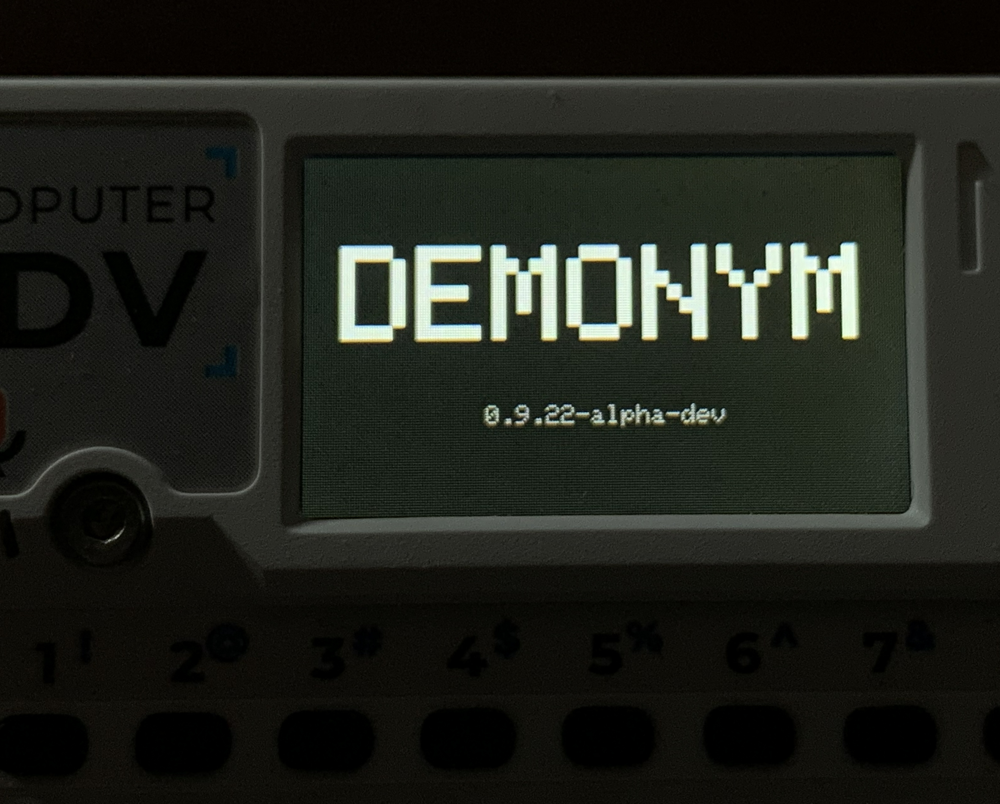
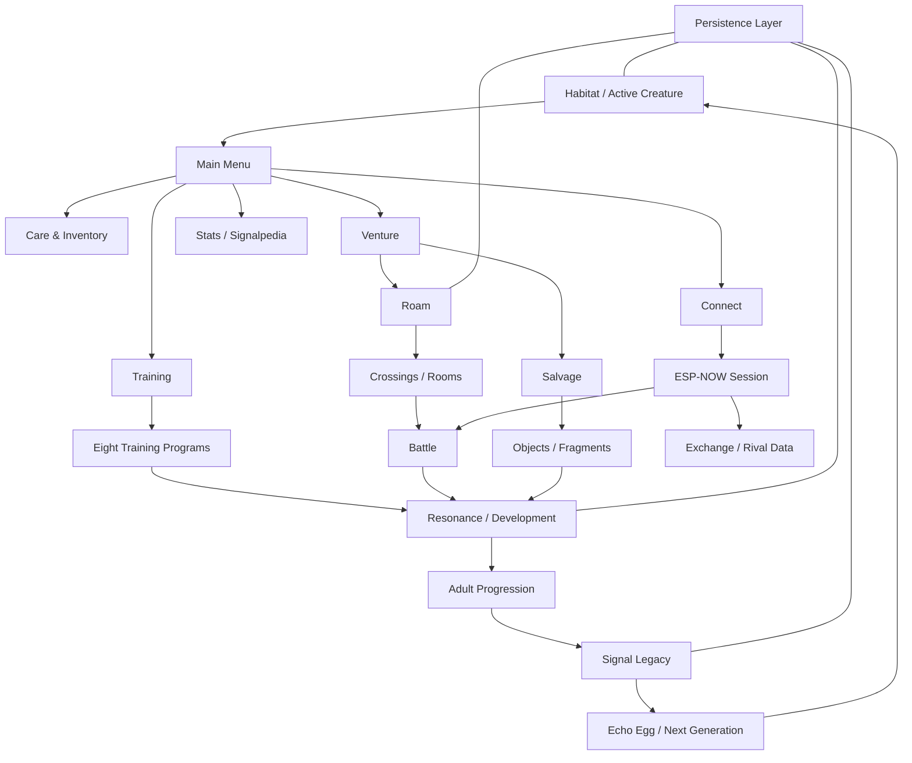

# Demonym

**Demonym** is a virtual creature game for ESP32 devices. I originally built it for the **M5Stack Cardputer ADV**.

You hatch and raise one creature at a time, train it through small games, explore Roam areas, recover objects and Fragments, battle other creatures, and eventually pass pieces of one generation into the next. Two Cardputers can also connect directly over ESP-NOW for battles and exchanges.

> **Current version:** v0.9.22 - Balance + Content Lock  
> **Main hardware:** M5Stack Cardputer ADV  
> **Language:** C++17  
> **Framework:** Arduino / PlatformIO  
> **Status:** Late alpha / content lock

I keep the full game source in a private repo. This public repo is where I am putting the player manual, firmware releases, project notes, a few code examples, and some of the tests I can share without putting the whole game online.



See [Repository Scope](REPOSITORY_SCOPE.md) for the public/private split.

## Quick links

- [Player Manual](player_manual.md) - how to play
- [Firmware Releases](https://github.com/eyeofbri/Demonym/releases) - downloadable builds
- [Supported Hardware](SUPPORTED_HARDWARE.md) - current hardware and devices I may port to later
- [Architecture](docs/architecture.md) - how the bigger pieces fit together
- [Development and Testing](docs/development-and-testing.md) - host tests and real-device testing
- [Code Examples](examples/README.md) - a few small examples I am comfortable keeping public

## What is in the game?

Demonym started as a procedural sprite experiment and kept growing. The current build includes:

- Egg, Juvenile, and Adult life stages
- eight procedural Lineages: Husk, Mire, Wisp, Fang, Choir, Machine, Cinder, and Veil
- 32x32 generated creature sprites
- Health, Energy, Hunger, Stress, sleep, food, medicine, and Habitat upkeep
- eight Training programs with separate difficulty and records
- procedural Roam areas with Depths, rooms, Crossings, navigation tools, extraction, merchants, and Salvage
- turn-based battles with moves, Guard, Retreat, Pressures, status effects, Adaptations, XP, and injury
- direct ESP-NOW multiplayer between two physical devices
- Signalpedia discovery tracking
- Signal Legacy and Echo Eggs for generational inheritance
- versioned save data with recovery and migration work added over the course of development

## Screenshots

I have started adding captures from the actual v0.9.22 build. I still want to add Roam, Salvage, hardware photos, and a few GIFs later.

| Habitat | Egg |
| --- | --- |
|  |  |

| Training | Battle |
| --- | --- |
|  |  |

| Connect | Signal Legacy |
| --- | --- |
|  |  |

| Signalpedia | Shop |
| --- | --- |
|  |  |

## Rough system map



## A few parts of the project I have spent a lot of time on

### Procedural creatures

Creature art is generated from compact identity data instead of saving a finished bitmap for every creature. The same compatible identity can rebuild the same creature after a reboot.

The generator grew quite a bit over time. It now accounts for Lineage, life stage, Adult form, palettes, faces, cleanup passes, visual history, inherited traits, and other state.

One early reference that helped a lot while I was figuring out procedural sprite generation was [yurkth/sprator](https://github.com/yurkth/sprator). Demonym's generator changed heavily as the project grew, but Sprator was a useful starting point for thinking about seeded creature shapes and small generated sprites.

More notes: [Creature Generation](docs/creature-generation.md)

### Saving on a small device

The save system went through a lot of changes after testing on real hardware. It moved from simpler saves into redundant checkpoints, recovery rules, migrations, retry/backoff behavior, repair tools, and later SD-backed history data.

I am documenting the general approach here, but I am keeping the full save/authentication code private.

More notes: [Persistence and Recovery](docs/persistence.md)

### Two-device battles

Connect uses ESP-NOW so two nearby Cardputers can find each other and play without a router or server. The same battle rules are used for local and linked battles. The networking side handles discovery, sessions, retries, turn sync, liveness, and state checks.

More notes: [ESP-NOW Connectivity](docs/connectivity.md)

### Host-side testing

By v0.9.22 the private project had **190 host-side validation and regression utilities**. I used them for things like generated creature checks, save compatibility, migrations, battle rules, Roam generation, economy limits, Legacy behavior, and source regressions.

Those tests do not replace real Cardputer testing. Display timing, keyboard input, storage, radio behavior, power, and performance still need to be checked on the actual device.

This public repo only includes a small set of tests for the examples I have made public.

More notes: [Development and Testing](docs/development-and-testing.md)

## Public code examples

I am not putting the full firmware in this repo. The [`examples/`](examples/README.md) folder has a few smaller pieces instead.

Right now it includes:

- a deterministic seeded random helper
- a fixed-size screen-history router
- active-time formatting
- a small procedural sprite demo
- a small redundant-checkpoint selection example

The sprite demo is a simplified example, not the real Demonym creature generator. I also added a note there about [Sprator](https://github.com/yurkth/sprator), which was one of the repos that helped me early on when I was experimenting with generated sprites.

## Hardware

The current game is built for the **M5Stack Cardputer ADV**.

I may make builds for other ESP32 devices later. If that happens, I plan to keep them in this same repo and attach a separate binary for each supported device to the same game release.

For example:

```text
demonym-cardputer-adv-v1.0.bin
demonym-cardputer-zero-v1.0.bin
demonym-m5stickc-plus-v1.0.bin
```

See [Supported Hardware](SUPPORTED_HARDWARE.md) and [Porting Notes](docs/porting.md).

## Firmware releases

I am using GitHub Releases for the larger public milestones instead of uploading every small internal build.

The public history starts with the early v0.1 through v0.9 milestone builds, plus v0.9.22 as the current content-lock snapshot. The `.bin` files live on the Release pages instead of normal Git history.

See [Release and Binary Notes](docs/releases.md).

## Documentation

| File | What it covers |
| --- | --- |
| [Player Manual](player_manual.md) | how to play Demonym |
| [Architecture](docs/architecture.md) | the main app and subsystem layout |
| [Creature Generation](docs/creature-generation.md) | generated creature sprites |
| [Persistence and Recovery](docs/persistence.md) | saving, recovery, and migration work |
| [ESP-NOW Connectivity](docs/connectivity.md) | device discovery and linked play |
| [Training Framework](docs/training-framework.md) | the shared structure behind Training games |
| [Roam and Battle](docs/roam-and-battle.md) | exploration and battle systems |
| [Development and Testing](docs/development-and-testing.md) | host tests and hardware testing |
| [Porting Notes](docs/porting.md) | what I plan to separate for other ESP32 targets |
| [Release Notes](docs/releases.md) | version and binary naming |

## What stays private

I am keeping the full game/application source private for now. That includes the complete BattleEngine, ESP-NOW packet/runtime code, save authentication code, full creature generator, game data tables, dev shortcuts, and unreleased experiments.

The public examples are here to show some of the code and ideas without making this repo a rebuildable copy of the whole game.

See [REPOSITORY_SCOPE.md](REPOSITORY_SCOPE.md) for more detail.

## Current direction

v0.9.22 is the **Balance + Content Lock** build. I am trying not to add another major mechanic at this point. The current work is mostly balance, cleanup, testing, content completion, presentation, and eventually making the hardware-specific parts easier to port.

---

Demonym is designed and developed by **Brian McLendon** (`eyeofbri`).
