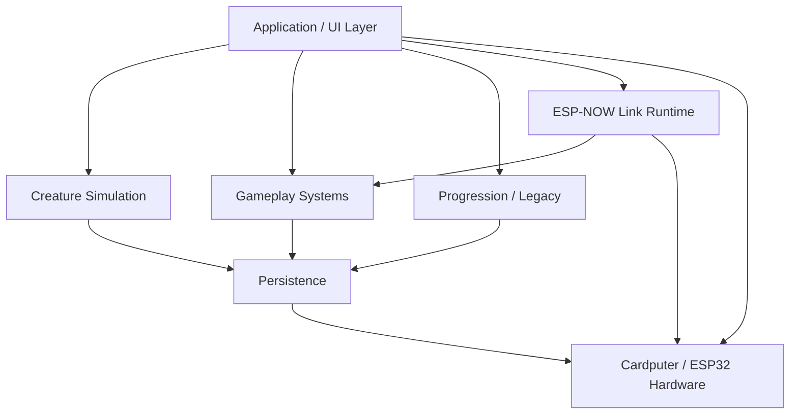

# Architecture

Demonym grew from a small procedural-sprite prototype into a multi-system embedded application. By v0.9.22 the private production tree is divided into focused modules rather than one monolithic sketch: creature simulation, generation, battle, adventure/Roam, Training, progression, Legacy, storage, audio, environment, shop/inventory, link networking, and application/UI routing.

The current private v0.9.22 tree contains **63 C++ implementation files and 81 headers** under the production source/include directories.

## High-level layers

### Application / UI

The application layer owns screen routing, input policy, transitions, timing guards, and presentation. Long-lived gameplay state is kept outside individual screens so moving through menus does not redefine the creature or run.

Some transitions—hatching, evolution, departure, incubation—are treated differently from ordinary screens. They deliberately bypass normal back-stack behavior so lifecycle events cannot accidentally be unwound like a menu.

### Creature simulation

Creature state contains compact persistent identity and simulation data. Separate systems advance active-time needs and derive behavior from life stage, temperament, progression, environment, and inherited history.

The Cardputer being powered off is intentionally different from active play: many care timers use **active time**, preventing a creature from becoming unhealthy simply because the device stayed in a drawer.

### Gameplay systems

The major playable systems are largely independent modules:

- Training programs
- Roam / procedural dungeon generation
- Crossings and encounters
- Salvage
- Battle
- Shop / Relay Work
- Rest / Dream Defense
- Inventory and Habitat objects

They communicate through compact result/state structures rather than freely mutating every other subsystem.

### Progression

Progression combines several horizontal and vertical tracks:

- Resonance level / experience
- move loadouts
- Fragments and Adaptations
- Signalpedia discoveries
- rivals
- Lineage Archive
- Signal Legacy / Echo Eggs

The intent is to let the organism accumulate history without turning every system into a single escalating power number.

### Persistence

Persistence is treated as its own subsystem because embedded storage failures can affect the entire game. Active-creature checkpoints, larger historical records, migrations, and settings do not all use exactly the same storage policy.

See [Persistence & Recovery](persistence.md).

### Networking

Linked play reuses deterministic game logic rather than implementing a separate multiplayer battle engine. ESP-NOW is responsible for establishing and maintaining a session and agreeing on inputs/state, while the battle rules remain shared with local encounters.

See [ESP-NOW Connectivity](connectivity.md).

## Design principle: deterministic cores, device-specific edges

Several systems are intentionally deterministic from compact inputs:

- creature appearance
- dungeon/room generation
- battle resolution
- selected encounter/progression behavior

That makes them easier to test on a desktop, reproduce after reboot, and synchronize across two devices.

Hardware-specific work—display, physical keys, flash/NVS, SD, audio, motion sensors, and ESP-NOW—stays closer to the edges.

This distinction is also the foundation for future ports to other ESP32 devices.
