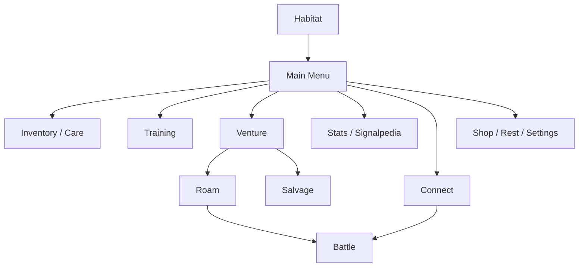

# Architecture

Demonym started as a small sprite generator and slowly turned into a fairly large embedded game. By v0.9.22, most of the work is split into smaller systems instead of living in one main sketch.

## Main app flow

The Habitat is the home screen. From there the player can move into menus, Training, Venture/Roam, Stats, Signalpedia, Connect, and other screens.

## Screen routing

Normal screens can be pushed onto a small fixed history stack so Back returns to the previous screen.

Lifecycle screens such as hatching, evolution, incubation, and departure are handled separately. I do not want Back to undo a hatch or drop a player into the middle of an old lifecycle sequence.

The public [`ScreenRouter.h`](../examples/core-utilities/ScreenRouter.h) is a small piece of that idea.

## Creature state

The active creature keeps persistent identity and progression data such as:

- seed and public identity
- Lineage and form
- life stage
- active age
- needs and care state
- Training history
- battle progression
- Fragments and Adaptations
- visual history
- Legacy information

A lot of care timing uses active play time instead of wall-clock time. Turning the Cardputer off is not supposed to punish the player because the device sat in a drawer for a week.

## Game modules

Training games, Roam, Salvage, and Battle each keep most of their tight update/render logic inside their own modules. When they finish, they return a smaller result that the rest of the game can apply to progression, rewards, or saving.

That helped keep a minigame from reaching into every part of the main app.

## Persistence

The save layer changed a lot during physical-device testing. The active creature moved toward redundant checkpoints and recovery rules, while larger history data could live on SD with fallback behavior.

More detail: [Persistence and Recovery](persistence.md)

## Multiplayer

Connect reuses the same deterministic battle rules as local encounters. ESP-NOW is mainly responsible for finding the other device, establishing a session, moving choices/state between devices, retrying when needed, and checking that both sides still agree.

More detail: [ESP-NOW Connectivity](connectivity.md)

## Deterministic pieces

Several systems depend on seeded or compact inputs:

- creature generation
- parts of Roam generation
- encounter setup
- battle resolution
- some Training layouts

This helps with saves, tests, reproducibility, and two-device play.

## Hardware-specific edges

The places I expect to change most when porting to another ESP32 device are:

- display
- physical input
- storage
- audio
- motion sensors
- ESP-NOW setup
- board/pin configuration

The longer-term goal is to keep those details closer to the edge of the project so the creature/game logic does not need a fork for every device.
