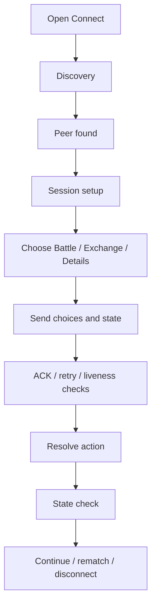

# ESP-NOW Connectivity

Demonym can connect two nearby Cardputers directly over ESP-NOW. No router or internet connection is needed for local linked play.

The Connect screen currently supports:

- **Battle** - fight using each player's current creature and moves
- **Exchange** - exchange supported game resources
- **Details** - look at basic rival information
- lightweight reactions/chat during a session

## Basic flow

The exact production protocol is private, but the rough flow looks like this:

The real link code has more retry states, sequence checks, timeouts, and recovery paths than the diagram.

## Why reuse the normal BattleEngine?

I did not want a separate multiplayer battle implementation with slightly different rules.

Both devices use the same battle logic. The network layer is there to make sure each side has the inputs and state needed to reach the same result.

That also made it easier to add normal battle animations and menus to linked battles later without changing the combat rules.

## Problems that showed up on real devices

Some of the more useful bugs came from two-device testing:

- one device moving to the next turn before the other was ready
- future-turn ACK packets arriving at the wrong time
- stale or dropped packets
- one side losing track of the session after a round or two
- simultaneous connection requests
- long waits with unclear feedback

Later versions added more ACK/retry handling, heartbeats/liveness checks, session reacquisition, larger receive buffering, and final state checks.

## Nearby signal detection

The project also experimented with low-duty nearby signal detection outside the full Connect flow. I kept this limited because continuous scanning had a noticeable performance cost in earlier experiments.

If I revisit broader physical signal features later, I am more likely to use short user-triggered scans than an always-on background scan.

## What I am not publishing here

I am keeping the full packet definitions, authentication/key handling, replay/tamper checks, and production link runtime private.

The public docs are enough to explain the flow without making the networking layer directly rebuildable.
