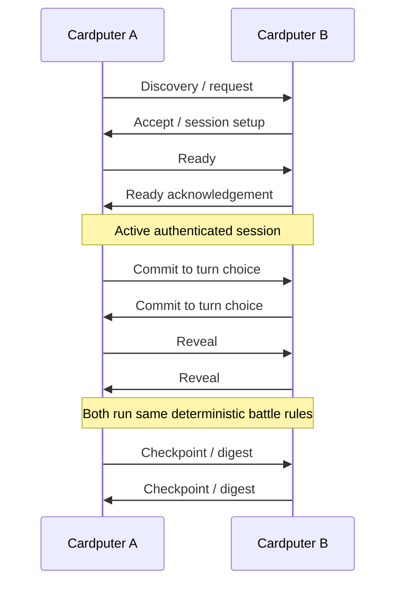

# ESP-NOW Connectivity

Demonym supports direct local interaction between two physical ESP32 devices using **ESP-NOW**. The production packet format and authentication implementation remain private; this page documents the higher-level design and the reliability problems the project had to solve.

## What Connect supports

On compatible builds, two nearby Demonym devices can establish a session and expose three primary actions:

- **Battle** — deterministic linked combat using each player's actual creature/loadout
- **Exchange** — controlled exchange of supported game resources
- **Details** — inspect rival information

The link experience also supports lightweight reactions/chat and remembered rivals.

## Session model

The real protocol contains additional retries, sequence checks, liveness handling, and failure states; the diagram is intentionally simplified.

## Why deterministic battle matters

Linked Battle does not stream animation state or treat one device as a permanent authoritative server. Both devices begin from agreed battle state, exchange verified choices, and run the same deterministic resolution.

That keeps radio traffic small and makes divergence detectable.

## Reliability work

Physical two-device testing exposed several classes of problems over development:

### Simultaneous connection attempts

Both players can press Connect at nearly the same time. The runtime needs a deterministic way to converge on one session instead of leaving two conflicting negotiations.

### Lost critical packets

Request, Ready, turn, and result boundaries need acknowledgement/retry behavior. A single lost packet should not automatically strand one device a state ahead of the other.

### Future-turn / stale acknowledgement races

An acknowledgement from one protocol moment can arrive after the local state has advanced. Sequence/session checks prevent an old or future message from being interpreted as permission to advance incorrectly.

### Liveness versus slow gameplay

A player can legitimately spend time reading a move or watching a presentation. Heartbeats distinguish an alive peer from a truly lost peer so gameplay time is not mistaken for radio failure.

### Reacquisition

Short interruptions should have a path to recover the current session instead of immediately destroying the match when both devices still agree on identity/state.

## Security boundary

Demonym's link protocol includes application-level validation used for game correctness and tamper/replay resistance. This public repository intentionally does not publish packet definitions, key derivation/authentication internals, or the complete production link runtime.

The project does not present local ESP-NOW game traffic as confidential communication.
