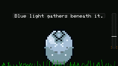
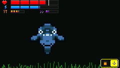

# Creature Generation

Demonym's creatures are generated from compact identity data instead of loading a finished sprite image for each creature.

The main reason I went this way was simple: I wanted two creatures to feel related without looking like recolors of the exact same sprite, and I wanted the same creature to be rebuildable from saved state.

| Egg | Creature in the Habitat |
| --- | --- |
|  |  |

## Early reference: Sprator

One repo that helped a lot early on was [yurkth/sprator](https://github.com/yurkth/sprator).

I found it while experimenting with tiny procedural sprites. It was useful for seeing how seeded randomness, mirrored forms, and small generated bodies could work together. Demonym's generator moved in its own direction as I added Lineages, stages, forms, palettes, history, and ESP32-specific constraints, but Sprator was an important reference near the start of the project.

## Basic idea

A creature keeps identity/state such as a seed, Lineage, stage, form, and history flags. The generator uses that data to rebuild the sprite when needed.

A simplified flow looks like this:

```text
identity seed
+ lineage
+ life stage / form
+ inherited traits
+ visual history
        |
        v
seeded body generation
        |
        v
cleanup / shape checks
        |
        v
palette + face + details
        |
        v
32x32 creature sprite
```

## Lineages

The eight Lineages are not just one body with different colors. Each one has its own body tendencies.

- **Husk** - heavier shell-like mass
- **Mire** - low, organic, spreading forms
- **Wisp** - signal-like and flexible silhouettes
- **Fang** - sharper predatory shapes
- **Choir** - clustered or resonant forms
- **Machine** - more mechanical structure
- **Cinder** - heat/flame-influenced shapes
- **Veil** - trailing or obscured forms

## Life stages and forms

Egg, Juvenile, and Adult do not all use the same finished body scaled up or down.

Juveniles keep the creature recognizable while leaving room for Adult development. Adult forms can shift the silhouette based on development and other stored traits.

## Repeatability

The same compatible identity should rebuild the same creature after a reboot.

That is useful for:

- small save data
- regression tests
- debugging a bad seed
- inheritance
- keeping multiplayer identity stable

## Cleanup and validation

Pure randomness produces a lot of bad tiny sprites, so generation also needs rules around things like disconnected pixels, overly empty bodies, shape bounds, and symmetry where a Lineage expects it.

The production generator has more cleanup and compatibility code than the small public demo.

## Visual history

Later versions added marks that can be derived from persistent history, including Adaptations, scars, boss marks, and inherited physical echoes. I treat those as layers on top of the creature's main identity instead of replacing it.

## Public example

[`examples/procedural-sprite-demo`](../examples/procedural-sprite-demo/) is a much smaller desktop example. It only shows a few of the ideas:

- seeded generation
- building part of a body from random cells
- simple neighbor cleanup
- mirroring
- repeatability checks

It is not the production generator. I kept out Lineages, palettes, faces, stages, Adult forms, history marks, and the larger cleanup/compatibility code.

The README in that example also links back to [Sprator](https://github.com/yurkth/sprator) because that project was one of the useful references behind the early direction.
