# Creature Generation

Demonym's creatures are generated rather than stored as complete sprite images. A persistent creature carries compact identity data; its visible body is reconstructed deterministically whenever needed.

The production generator remains private, but its architecture can be described publicly.

## Inputs

A generated sprite is influenced by a combination of:

- visual seed
- Lineage
- life stage
- Adult form
- generator compatibility version
- inherited or earned visual-history flags

The same compatible input set produces the same base individual after reboot.

## Production pipeline

```mermaid
flowchart LR
    A[Persistent identity] --> B[Seeded lineage body plan]
    B --> C[Shape growth / variation]
    C --> D[Symmetry + cleanup]
    D --> E[Life-stage modifiers]
    E --> F[Adult-form modifiers]
    F --> G[History / Adaptation marks]
    G --> H[Validation]
    H --> I[Palette + face]
    I --> J[Normal + blink sprite]
```

### 1. Lineage body plan

Each of the eight Lineages starts from a different procedural grammar rather than a recolor of one universal body:

- **Husk** — heavier shell-like mass
- **Mire** — low, organic, spreading forms
- **Wisp** — flexible signal-like silhouettes
- **Fang** — sharper predatory geometry
- **Choir** — clustered/resonant shapes
- **Machine** — deliberate mechanical structure
- **Cinder** — heat/flame-influenced silhouettes
- **Veil** — trailing or obscured forms

### 2. Shape variation

The generator uses deterministic pseudo-random choices and multiple shape-building/cleanup techniques. The exact production sequence is private, but the project has used approaches such as seeded growth, random walks, cellular-automata-style smoothing, mirroring, component cleanup, cavity checks, and lineage/form-specific appendages.

### 3. Validation

Procedural generation is treated as code that needs testing, not just visual luck. Generated bodies are checked for properties such as:

- size bounds
- valid connected structure
- symmetry where required
- valid face placement
- deterministic repeatability
- fallback frequency

The original v0.1 prototype already included batch generator validation; later versions expanded this style of host-side QA across the rest of the project.

### 4. Persistent history without storing a bitmap

Later development added reversible visual history—Adaptations, scars, boss marks, inherited physical echoes, and environmental accents. These can be derived from compact state and layered into generation without replacing the creature's original identity.

That lets the same individual remain recognizable while visibly accumulating history.

## Public reference example

[`examples/procedural-sprite-demo`](../examples/procedural-sprite-demo/) contains a deliberately simplified desktop example demonstrating three ideas used by the real system:

1. deterministic seeded randomness
2. generation of only one half of a body
3. mirrored output with validation

It is **not** Demonym's production generator and intentionally omits Lineages, palettes, faces, life stages, forms, cleanup passes, and visual-history logic.
