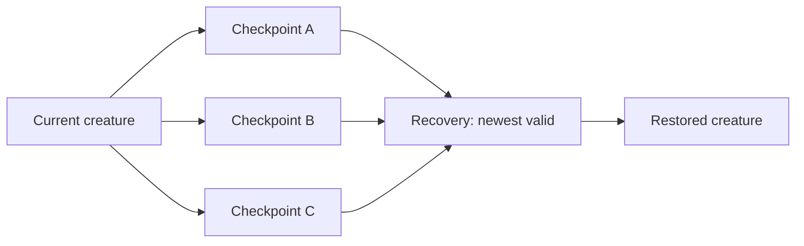

# Persistence & Recovery

Persistence became one of Demonym's most heavily tested subsystems because a virtual creature only works if its identity survives real hardware problems.

The production storage/authentication implementation remains private. This document describes the architecture and the engineering decisions around it.

## Goals

Demonym's storage system is designed around several priorities:

- preserve the current creature before preserving convenience data
- detect invalid or incompatible records
- keep older valid checkpoints available during replacement
- avoid blocking gameplay with repeated failing flash writes
- migrate formats deliberately
- make degraded states visible in diagnostics
- allow the game to run without requiring an SD card

## Active creature checkpoints

The active creature uses multiple internal checkpoints rather than one replace-in-place blob.

Conceptually:

Each candidate is validated before it can become the recovery source. The newest valid record wins; a failed replacement does not intentionally destroy the last known-good state first.

## Write backoff

One hardware test device eventually entered a state where fresh NVS allocations repeatedly failed. The first implementation retried too aggressively, turning a storage problem into visible input/frame-time problems.

The save path was changed so failures enter a bounded retry/backoff schedule instead of attempting a blocking write every frame. Routine interactions can mark state dirty and checkpoint shortly after input/animation settles rather than synchronously inside the input event.

This was a major lesson from physical testing: **storage latency is gameplay latency when both occur on the same embedded loop**.

## Isolated recovery and degraded operation

Later versions separated redundant checkpoints so one unhealthy allocation path was less likely to compromise the entire recovery set. A deliberately degraded fallback mode was also introduced for devices that could still update an already-existing authenticated checkpoint but could not create healthy fresh slots.

Repair remains an explicit maintenance action rather than silently erasing all device storage.

## Hybrid SD + internal storage

The current architecture keeps the active creature recoverable internally and can use SD-backed records for larger/growing history such as archives and logs when an SD card is available.

The SD card is optional. Records stored there use a versioned envelope and verified replacement/backup flow. Historical records can migrate only after the new copy verifies successfully.

A small internal core preserves essential generational identity even when larger archive data lives on SD.

## Compatibility

Persistent structures are versioned. The application has repeatedly preserved old creatures while changing surrounding systems by using:

- explicit record versions
- fixed-size or carefully migrated structures
- sidecar stores for new growth where appropriate
- derived state instead of adding persistent flags unnecessarily
- compatibility constants for deterministic generators/rules

This approach prevents every feature addition from forcing a destructive reset.

## Public reference example

[`examples/persistence-model`](../examples/persistence-model/) demonstrates only the **newest-valid checkpoint selection** idea. It intentionally omits:

- actual NVS/SD I/O
- authentication/integrity implementation
- save encoding
- production record layouts
- migration code
- retry/backoff details
- secret material
