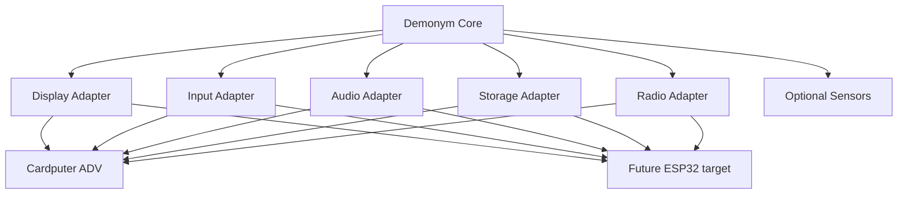

# Porting Strategy

Demonym currently has one fully supported hardware target: **M5Stack Cardputer ADV**. Future releases may target additional ESP32 devices.

The public repository is therefore named for the game, not the board.

## Goal

A new device should not require a fork of the gameplay rules. The long-term direction is to keep a shared Demonym core and isolate hardware differences at the edges.



## Porting checklist

A target needs answers for at least these areas:

### Display

- resolution and orientation
- sprite scaling
- text density
- full-screen canvas memory cost
- color format / driver behavior

### Input

- directional navigation
- confirm/back
- held input versus key edges
- shortcuts used by Training/Roam
- text entry if Link Chat is supported

### Audio

- speaker/buzzer availability
- asynchronous cry/tone playback
- volume control

### Storage

- internal NVS capacity/behavior
- optional SD availability
- safe recovery policy if the target lacks SD

### Networking

- ESP-NOW support
- coexistence with other Wi-Fi features
- peer/session timing on the device's ESP32 variant

### Sensors

Motion Ecology should be optional. A target without a compatible accelerometer must still be able to run the core creature/game loop.

### Performance

The target must sustain acceptable UI/gameplay pacing while respecting its RAM and framebuffer limits.

## Release strategy

Ports live under the same game version when they are compatible at the gameplay/content level. Hardware is expressed in the release asset name:

```text
demonym-cardputer-adv-v1.0.bin
demonym-cardputer-zero-v1.0.bin
demonym-cyd-v1.0.bin
```

A target can lag behind temporarily without forcing a separate repository. Its supported version should be documented in [SUPPORTED_HARDWARE.md](../SUPPORTED_HARDWARE.md).
