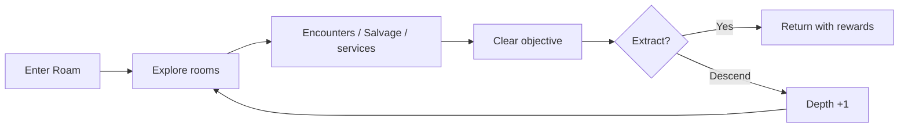

# Roam and Battle

Roam and Battle make up most of Demonym's risk/reward loop. Roam creates the expedition and encounters. Battle handles creature fights using the same main rules whether the opponent is local or on another Cardputer.

## Roam

A Roam run keeps its own generated layout, explored state, Depth, navigation progress, encounters, rewards, and extraction state.

I still want to add a good Roam screenshot here once I have one that shows the map and navigation tools clearly.

### Depth loop

After clearing a layer, the player can extract or go deeper.

Going deeper starts a fresh layer, resets some navigation help, raises the difficulty, and can improve rewards.

### Room types

The generator mixes structural room roles with biome/flavor variants. v0.9.22 includes things such as Combat, Hard Combat, Trial, Elite, and Boss rooms, with names/themes layered on top.

### Navigation tools

Route Map, Compass, Relay Anchors, and Portable Anchors change how easy it is to read or leave a run. They are run tools, not permanent full-map visibility.

## Battle

The battle rules are deterministic from agreed state and inputs. That is useful for both normal encounters and ESP-NOW battles.

Main battle pieces include:

- move loadouts
- Energy costs and cooldowns
- Guard
- Retreat
- attack/defense/resource modifiers
- Pressures
- status effects
- Adaptations
- XP and Resonance
- injury and recovery

## Pressures

There are five combat Pressures:

- Force
- Signal
- Heat
- Corrosion
- Echo

The UI describes move effectiveness as **NORMAL**, **BONUS**, or **REDUCED** so the player does not need to remember a chart of raw multipliers.

## Status effects

Current status families include:

- Stagger
- Disruption
- Burn
- Corrosion
- Echo Interference

These are part of battle resolution, not just visual effects.

## Rules vs. animation

I keep battle results separate from the animation timing as much as possible. Later versions added lunges, recoil, flashes, particles, animated meters, Pressure effects, and slower result timing without making the outcome depend on a particular render frame.

That matters even more in linked battles because the two Cardputers still need to agree even if one screen draws a frame a little earlier than the other.
