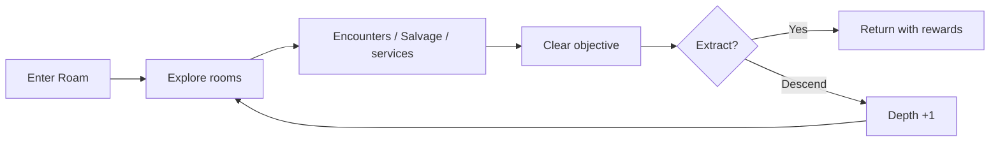

# Roam & Battle

Roam and Battle form Demonym's main risk/reward loop. Roam produces procedural spaces and encounters; Battle resolves creature conflict using deterministic rules shared by solo and linked play.

## Roam

A Roam run tracks its own procedural identity, explored state, Depth, navigation progress, rewards, encounters, and extraction state.

### Depth loop

After clearing a layer, the player can choose to extract or descend. Descending creates a fresh deeper layer, resets some run navigation advantages, increases challenge, and improves potential rewards.

### Room identity

The generator combines structural room roles with biome/flavor identity. v0.9.22 includes Combat, Hard Combat, Trial, Elite, and Boss roles that can surface names such as Mire, Static, Cinder, or Echo variants without requiring a separate hard-coded dungeon for every theme.

### Navigation tools

Route Map, Compass, Relay Anchors, and Portable Anchors change how much information or extraction flexibility a run provides. These are deliberately run-oriented tools rather than permanent omniscience.

## Battle

Battle is deterministic from agreed inputs/state so the same engine can support both local encounters and ESP-NOW linked matches.

Major concepts include:

- move loadouts
- Energy costs and cooldowns
- Guard
- Retreat
- attack / defense / battle-resource modifiers
- Pressures
- status effects
- Adaptations
- XP and Resonance progression
- injury/recovery consequences

## Pressures

Demonym uses five combat Pressures:

- Force
- Signal
- Heat
- Corrosion
- Echo

Move effectiveness is presented to the player as **NORMAL**, **BONUS**, or **REDUCED** rather than requiring the player to memorize opaque numeric multipliers.

## Status effects

Current combat status families include:

- Stagger
- Disruption
- Burn
- Corrosion
- Echo Interference

They are integrated into deterministic battle resolution rather than being purely visual effects.

## Presentation versus rules

The rule engine and presentation are intentionally separable. Later versions added lunges, recoil, hit flashes, particles, animated meters, pressure effects, and result pacing without requiring the underlying combat outcome to depend on rendering frame timing.

That separation is particularly important for two-device play: both Cardputers must agree on the battle state even if their display timing differs slightly.
