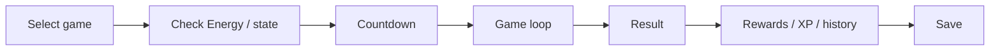

# Training Framework

Training started with one minigame and grew into eight programs by v0.9.22.

| Signal Drift | Signal Hopper |
| --- | --- |
|  |  |

*Signal Ascent*

## Current programs

| Program | Main idea |
| --- | --- |
| Signal Drift | move through gates while keeping Stability |
| Signal Breaker | small brick-breaker / Arkanoid-style game |
| Core Stack | compact Sokoban-style crate placement |
| Drift Fall | falling / landing control |
| Signal Coil | timing and route challenge around a growing path |
| Signal Hopper | Frogger-style lane crossing |
| Signal Ascent | automatic-bounce vertical platforming |
| Packet Catch | catch useful packets and avoid hazards |

## Shared flow

The games play differently, but they follow roughly the same outside flow:

A later change was to show the result before doing heavier save work. That keeps the game from feeling like it ignored the last input while storage is busy.

## Separate difficulty

Each Training program has its own difficulty instead of one global Training level. A player can be good at one game and still be at an early tier in another.

## Common problems each game has to handle

- frame pacing
- held keys vs. single-press input
- the small 240x135 screen
- clean start/countdown/result screens
- Energy cost and rewards
- quitting without leaving broken state behind
- keeping the tight game loop separate from heavier save/progression work

## Why keep the games separate?

Keeping each minigame in its own module made it easier to tune one without breaking the others, run host-side checks on game logic, and eventually swap the display/input side for another ESP32 device.
