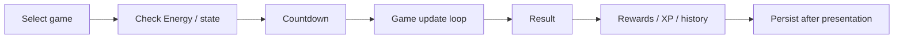

# Training Framework

Training began with one minigame and evolved into a reusable embedded game framework supporting **eight** distinct programs in v0.9.22.

## Current Training programs

| Program | Core idea |
| --- | --- |
| Signal Drift | pulse through moving gates while preserving Stability |
| Signal Breaker | brick-breaker / Arkanoid-style signal clearing |
| Core Stack | compact Sokoban-style crate placement |
| Drift Fall | vertical falling / landing control |
| Signal Coil | timing/route challenge around a growing signal path |
| Signal Hopper | Frogger-style lane crossing |
| Signal Ascent | automatic-bounce vertical platforming |
| Packet Catch | catch useful packets while avoiding hazards |

## Shared lifecycle

Although the games play differently, the application treats them through a common lifecycle:

The result-first/persist-second distinction matters on embedded hardware. Later versions deliberately present a result before performing heavier persistence work so the player receives immediate feedback even when storage is slow.

## Independent difficulty

Training difficulty is tracked per program rather than forcing every game to share one global difficulty. A player can be experienced in one program while still learning another.

Difficulty influences game-specific parameters while preserving each program's identity.

## Reusable design concerns

Each Training module needs to handle some common embedded constraints:

- bounded frame cadence
- deterministic/randomized run seeds where useful
- held-key versus edge-triggered input
- small 240×135 presentation area on Cardputer ADV
- explicit result structures rather than arbitrary cross-system mutation
- Energy/reward integration outside the tight inner gameplay loop
- clean abort behavior

## Why keep each minigame modular?

A separate module per game makes it possible to validate the logic on the host, change one game's difficulty curve without destabilizing another, and eventually adapt presentation/input for other ESP32 hardware targets.
