# DEMONYM

## Keeper's Instruction Manual

**Player Manual - v0.9.22.2**  
**Target hardware:** M5Stack Cardputer ADV

> Raise it. Train it. Carry it.  
> See what answers back.

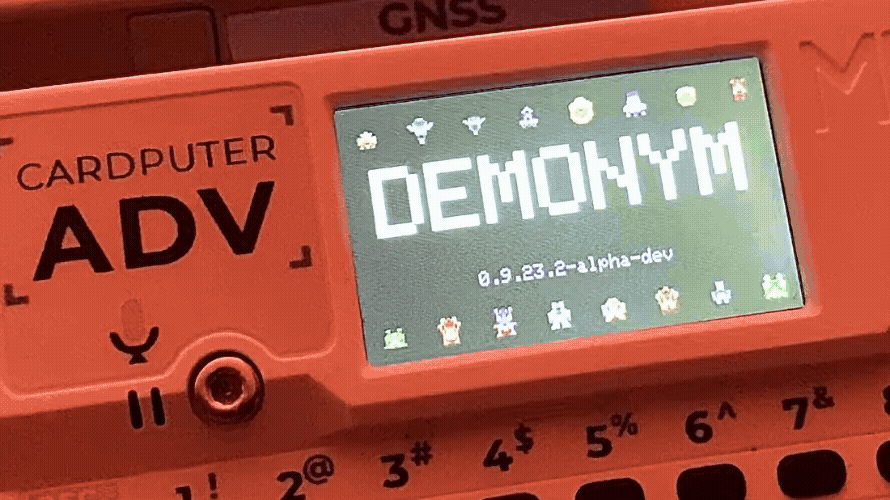

---

<a id="contents"></a>

## Contents

- [Welcome, Keeper](#welcome-keeper)
- [What Is a Demonym?](#what-is-a-demonym)
- [Getting Started](#getting-started)
- [Controls](#controls)
- [The Habitat](#the-habitat)
- [Life Cycle](#life-cycle)
- [Health, Energy, Hunger & Stress](#needs)
- [Care, Food & Medicine](#care)
- [Sleep & Rest](#rest)
- [Habitat Waste & the Scoop](#waste)
- [Inventory & Coins](#inventory)
- [The Shop](#shop)
- [Stats, Temperament & Development](#stats)
- [Training](#training)
- [Training Programs](#training-programs)
- [Relay Work](#relay-work)
- [Venture](#venture)
- [Roam](#roam)
- [Depths](#depths)
- [Crossings & Rooms](#crossings)
- [Navigation Tools & Extraction](#navigation)
- [Salvage](#salvage)
- [Habitat Objects & Junk](#habitat-objects)
- [Battle](#battle)
- [Pressures](#pressures)
- [Status Effects](#status-effects)
- [Moves, Guard & Retreat](#moves)
- [Experience, Injury & Recovery](#experience)
- [Fragments & Adaptations](#fragments)
- [Connect](#connect)
- [Battle, Exchange & Details](#connect-options)
- [Rivals, Reactions & Chat](#rivals)
- [Signalpedia](#signalpedia)
- [Lineages](#lineages)
- [Signal Legacy](#signal-legacy)
- [Echo Eggs & New Generations](#echo-eggs)
- [Motion & Carrying](#motion)
- [Saving & Power](#saving)
- [Keeper Tips](#keeper-tips)
- [Glossary](#glossary)
- [Field Notes](#field-notes)

---

<a id="welcome-keeper"></a>

# Welcome, Keeper

Demonym is a virtual creature game built around one persistent creature at a time. You hatch it, care for it, train it, explore with it, battle, collect things, and eventually carry parts of its history into another generation.

You are the **Keeper**. There is no single best way to raise a Demonym. Good care matters, but Training, Stress, exploration, battles, discoveries, and inherited traits can all push a creature in different directions.

The main idea is simple: keep it going, try things, and see what kind of creature it becomes.

> **KEEPER TIP**  
> A lot of small things carry forward. Training scores, Fragments, scars, rivals, Habitat objects, and inherited traits can matter later.

[Back to Contents](#contents)

---

<a id="what-is-a-demonym"></a>

# What Is a Demonym?

Every active creature has a few parts that make up its identity.

Its **individual identity** is persistent. It has a generated name, a public identifier, a visual seed, a lineage, a history, and a growing record of what has happened to it.

Its **Lineage** describes the broad family it belongs to. Lineage influences appearance, natural strengths, battle pressures, passive traits, and the kinds of forms a creature may take as it matures.

Its **Form** reflects development within that Lineage. A Demonym does not simply become "a stronger version" of its juvenile body. Care, stress, training, temperament, inherited tendencies, and other developmental pressures can influence what its Adult body becomes.

Its **history** includes things such as training results, battles, discoveries, rivals, Fragments, adaptations, and important life events.

Its **Legacy** is what may remain when that creature is no longer the active generation.

Two Keepers can begin with similar creatures and still end up with creatures that look, behave, fight, and develop differently.

### A Demonym is persistent

Demonym uses one active creature at a time. It does not reset when you close a menu, lose a battle, or turn the device off.

The Habitat remembers.

So does the lineage.

<!-- I still want to add a clean Stats identity screenshot here. -->

[Back to Contents](#contents)

---

<a id="getting-started"></a>

# Getting Started

v0.9.22.2 opens with the newer animated Demonym title screen, then moves into the Habitat.

On a fresh installation, Demonym creates a new creature at the **Egg** stage.

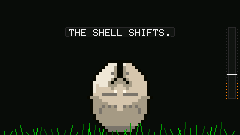

The Egg is the first part of the game, not just a loading screen.

Watch the Heat and Progress indicators. The Egg periodically responds to a manual nudge. Press **Enter** when interaction is available to help move incubation forward. Repeated input during the cooldown does not help; the Habitat will show that the Egg is not ready for another nudge.

Warm, well-timed interaction advances incubation more effectively than frantic input.

When incubation completes, the Egg hatches into a **Juvenile**.

The early game starts small. Feed it. Rest it. Observe it. Try Training. Learn how quickly Energy disappears. Open Stats. Listen to its cry. Let it spend some time alive before trying to optimize everything.

The wider game opens as the creature develops.

### The basic loop

```text
EGG
  ↓
HATCH
  ↓
CARE + OBSERVE
  ↓
TRAIN
  ↓
EVOLVE
  ↓
VENTURE + BATTLE + DISCOVER
  ↓
BUILD A HISTORY
  ↓
SIGNAL LEGACY
  ↓
ECHO EGG
  ↓
NEW GENERATION
```

That is the long loop.

The short loop is much simpler:

```text
CHECK HABITAT
→ DEAL WITH NEEDS
→ CHOOSE AN ACTIVITY
→ RETURN WITH CONSEQUENCES
```

[Back to Contents](#contents)

---

<a id="controls"></a>

# Controls

Demonym is played from the Cardputer keyboard.

The game uses the Cardputer's punctuation cluster as a compact directional pad:

| Input       | General Action                                                   |
| ----------- | ---------------------------------------------------------------- |
| `;`         | Up                                                               |
| `,`         | Left                                                             |
| `.`         | Down                                                             |
| `/`         | Right                                                            |
| `Enter`     | Select / confirm / use                                           |
| `` ` ``     | Back / open menu / cancel                                        |
| `Backspace` | Context action; Inventory uses it for drop/removal prompts       |
| `Q`         | Toggle sound                                                     |
| `V`         | Cycle volume                                                     |
| `C`         | Creature cry in appropriate screens; chat during a linked battle |
| `Space`     | Context action in some activities and Habitat tools              |

Some games also accept other convenient directional or action keys when displayed on-screen. When a minigame uses special controls, its intro card explains them before play begins.

### Taking screenshots

v0.9.22.2 includes a built-in screenshot shortcut. Hold **Fn/Opt** and press **P** to save the current game screen to the SD card.

Screenshots are saved as full 240x135 PNG files in:

```text
/demonym/screenshots/
```

The filenames count upward automatically:

```text
shot_001.png
shot_002.png
shot_003.png
```

An SD card needs to be mounted for the capture to be saved. This is also how I am capturing most of the clean game screenshots used in this manual and the public repo.

### Menus

Use the directional controls to move the highlight.

Press **Enter** to select.

Press **Back** (`` ` ``) to return to the previous screen. From the Habitat, Back opens the main menu.

### In Roam

Roam has its own pause menu. Use Back to open it. Controls, Stats, Inventory, and expedition exit options are available there.

### In battle

Battle shows the commands that are available for the current turn. Use the directional controls to move and **Enter** to choose.

> **KEEPER TIP**  
> If you are unsure what a button does, look at the footer. Demonym usually places the currently relevant control hint at the bottom of the screen.

<!-- I still want to add a labeled Cardputer keyboard photo here. -->

[Back to Contents](#contents)

---

<a id="the-habitat"></a>

# The Habitat

The **Habitat** is the main screen and the creature's home.

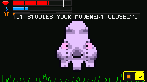

It is not just a status panel. The Demonym moves through it, sleeps there, reacts to objects there, produces waste there, and communicates much of its condition through animation and small visual signals.

The Habitat generally shows:

- the active Demonym
- Health
- Energy
- Hunger and/or hunger-related warnings
- Stress
- alert icons when something needs attention
- short observation messages
- Habitat objects
- waste, when present.

The Habitat only shows the basics. Open **Stats** for more detail.

### Observation

Press **Enter** on the Habitat when no other action is active to observe or interact with the creature.

Observation messages are short. They give clues about condition, temperament, development, or what the creature is doing.

### Alerts

Orange alert glyphs indicate something deserves attention. Alerts can represent conditions such as:

- low Health
- low Energy
- high Hunger
- high Stress
- Habitat waste.

Alerts are warnings, not orders. You can still decide that one need is more urgent than another.

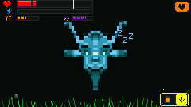

> **FIELD NOTE**  
> Quiet time still counts. The creature keeps building active-time history even when nothing major is happening.

[Back to Contents](#contents)

---

<a id="life-cycle"></a>

# Life Cycle

A Demonym passes through three major life stages:

1. **Egg**
2. **Juvenile**
3. **Adult**

## Egg

The Egg is still forming. Most normal activities are unavailable.

Your first responsibility is incubation. Give the Egg time and use manual nudges when the Heat system allows it.

An Egg cannot be treated like an Adult. It cannot simply be forced into Training, sent into Roam, or handed a pile of consumables.

## Juvenile

The Juvenile stage is where development begins to diverge.

Training, care, stress, recovery, interaction, and temperament all contribute to the kind of creature that eventually emerges.

Development is shown in broad states. The exact formula stays hidden, so watch the creature's overall care, Training, Stress, and behavior.

## Adult

An Adult has access to the widest set of systems.

Adult creatures can take on deeper Ventures, participate fully in battle systems, use Connect features with another compatible device, accumulate richer history, and eventually contribute to **Signal Legacy**.

Adult does not mean "finished."

At this point the creature can start leaving a stronger record for future generations.

<!-- I still want to add a clean Egg / Juvenile / Adult comparison here. -->

[Back to Contents](#contents)

---

<a id="needs"></a>

# Health, Energy, Hunger & Stress

Four visible conditions define day-to-day care.

## Health

**Health** represents physical condition.

Battle damage, dangerous Training, Roam encounters, and other failures can reduce it.

Healing items and sleep can restore Health, but Hunger can limit recovery. If the creature is badly fed, medicine alone may not bring it back to full Health.

If the Health bar refuses to fill completely, check Hunger.

## Energy

**Energy** is the creature's immediate activity resource.

Training, Salvage, battle moves, exploration, and other active systems can consume Energy.

Food, sleep, recovery rooms, and certain items can restore it.

Low Energy may prevent an activity from starting or make a risky expedition a bad idea.

## Hunger

**Hunger** rises as the creature remains active.

Lower is better.

Food reduces Hunger, and some foods also restore Energy or provide secondary benefits.

Hunger can limit how much Health can be recovered, so feeding matters when treating an injured creature.

## Stress

**Stress** represents strain.

Stress can rise from injuries, repeated failure, risky Training, poor Habitat conditions, exhaustion, and some difficult encounters.

Rest, successful care, Calm Tonic, and certain other outcomes can lower it.

Stress also matters to development and temperament. A creature that survives constant pressure may not mature the same way as one raised carefully.

> **KEEPER TIP**  
> Health answers "How hurt is it?"  
> Energy answers "How much can it do right now?"  
> Hunger answers "How well can it recover?"  
> Stress answers "How much strain has accumulated?"

[Back to Contents](#contents)

---

<a id="care"></a>

# Care, Food & Medicine

Most care is handled through **Inventory** and **Rest**.

Consumable items may include food, Energy recovery, medical supplies, and stress-management items.

Common examples include:

### Ration

Basic food. Reduces Hunger.

### Protein

Food with a stronger Energy component.

### Energy items

Useful when the creature is healthy enough to continue but lacks the Energy required for Training, battle, or expedition activity.

### Med Patch

Basic medical recovery.

### Med Kit

A stronger healing tier.

### Trauma Kit

Heavy medical recovery for serious damage.

Medical items cannot ignore the Hunger-based Health limit. Feed first if recovery appears capped.

### Calm Tonic

Reduces Stress.

### Other supplies

Roam, merchants, Salvage, training rewards, and special rooms can provide additional consumables.

Using an item that cannot currently help should not be treated as a requirement. Read the item description before spending it.

### Sleeping creatures

Some items require the creature to be awake. If your Demonym is sleeping, let it finish or wake it through the proper Rest flow instead of trying to feed or medicate it through the Habitat.

[Back to Contents](#contents)

---

<a id="rest"></a>

# Sleep & Rest

Rest is not an instant "fill bars" command.

When a Demonym sleeps, the Habitat changes to a sleeping state and recovery happens over time. Health and Energy gradually improve while the creature remains asleep.

Rest activities add a small interactive layer to this process.

Depending on the current build and available Rest options, you may encounter activities such as:

- **Dream Tuning**
- **Signal Breathing**
- sleep-defense sequences in which disturbances must be kept away from the sleeping signal.

The goal of Rest is not maximum score. It is recovery.

A peaceful session generally produces better recovery than an interrupted one.

Rest can also help reduce Stress and may influence the creature's longer-term development.

Some Rest actions have a cooldown. If the system tells you to return later, use Inventory, Habitat care, Training, or another activity instead of repeatedly reopening Rest.

> **KEEPER TIP**  
> A tired creature with high Hunger is not a good candidate for a long Venture. Sleep and food are cheaper than retreating from the bottom of a bad run.

<!-- I still want to add a sleeping Habitat / Rest screenshot here. -->

[Back to Contents](#contents)

---

<a id="waste"></a>

# Habitat Waste & the Scoop

Food eventually becomes somebody else's problem.

Habitat waste can appear over time, including after digestion.

Waste is visible in the Habitat and can contribute to Stress if ignored.

The **Scoop** is a reusable Shop tool. Once bought, it stays with the Habitat and is not consumed after use.

From the Habitat, **Space** opens the compact utility strip when the Scoop is available. Select the cleanup action and time the pickup.

A successful Scoop use removes waste and provides a small care benefit. The Scoop then enters a short cooldown before it can be used again.

The tool is reusable:

- it is not consumed
- it is not a normal trade item
- it is part of the Keeper's permanent care kit.

> **FIELD NOTE**  
> The creature does not seem bothered by any of this.

[Back to Contents](#contents)

---

<a id="inventory"></a>

# Inventory & Coins

Inventory stores the practical things the Keeper has collected.

You may carry:

- food
- medicine
- Energy supplies
- stress-management items
- expedition supplies
- rewards
- some special-use objects.

**Coins** are the common currency used by Shops and certain Roam activities.

Inventory space and item stack limits matter. A prize cannot always be added if its stack is already full. Some systems convert an impossible reward into Coins or another consolation instead.

### Using items

Highlight an item and press **Enter**.

If the item cannot be used in the current condition, Demonym generally leaves it intact.

### Dropping items

Inventory includes a deliberate drop/removal action with confirmation. This prevents an accidental Back press from throwing away supplies.

### Habitat Objects are different

Habitat Objects are collected and managed as a distinct category. They are not ordinary medicine or food. See [Habitat Objects & Junk](#habitat-objects).

[Back to Contents](#contents)

---

<a id="shop"></a>

# The Shop

The Shop is a permanent safe-space economy screen run by the Habitat's shopkeeper.

Depending on progress, it can include:

- **Buy**
- **Sell**
- **Work**

## Buy

Spend Coins on food, healing, care tools, and other supplies.

Some items are one-time purchases. The **Scoop**, for example, becomes part of the Habitat toolset after purchase.

Other stock may become more useful once Venture opens.

## Sell

Unneeded goods, Salvage, and certain recovered objects can be turned back into Coins.

Do not sell every unfamiliar object immediately. Some things exist because the Habitat can react to them.

## Work

Relay Work becomes available after the creature has begun proving itself through Training and development.

Work is a low-risk way to earn Coins without going into combat or Roam.

The shopkeeper is also part of progression. New stages and milestones may change what the Shop can offer or what the shopkeeper has to say.

| Shop | Shop detail |
| --- | --- |
| 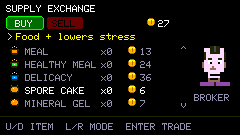 | 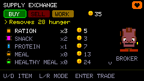 |

[Back to Contents](#contents)

---

<a id="stats"></a>

# Stats, Temperament & Development

The Habitat shows only what you need at a glance.

**Stats** shows what has been accumulating underneath.

Depending on the creature's stage and discoveries, Stats can include:

- Name
- Type / Lineage
- public ID
- Health
- Energy
- Hunger
- Stress
- development state
- battle level and experience
- training history
- equipped moves
- Fragments / Adaptations
- temperament traits
- legacy-related information.

## Temperament

Temperament is not a morality meter.

Traits such as Trust, Curiosity, Adaptability, Aggression, and Independence can grow from how the creature is treated and what it survives.

A highly aggressive creature is not simply "bad." A very trusting creature is not automatically "better."

Temperament helps the creature become specific.

## Development

Juvenile development depends on a mix of care and behavior. The exact hidden scores are not shown.

Watch broad development states, changes in behavior, Training history, Stress, and the creature's reactions.

If the creature is healthy, active, and Training, development will move forward over time.

> **KEEPER TIP**  
> Do not try to solve evolution from one number. In Demonym, a life pattern matters more than a single perfect action.

[Back to Contents](#contents)

---

<a id="training"></a>

# Training

Training is the safest place to improve the creature while also learning how it behaves under pressure.

Each Training program is a small arcade game with its own rules.

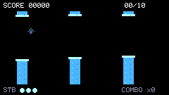

Training can affect:

- Energy
- Stress
- Health in dangerous runs
- temperament
- development
- Resonance / progression
- Coins and rewards
- persistent best scores.

## Independent difficulty

Training programs remember their own difficulty.

Winning a program advances that program's tier. Failing or aborting does not automatically push the next attempt upward.

This means mastering Signal Breaker does not make Signal Hopper harder.

Best scores are also remembered.

## Training is not free

A failed run still happened.

Energy was spent. Stress may have risen. A collision may have hurt.

Exceptional play can be rewarding, but reckless score-chasing can leave the creature in worse condition than when it entered.

## Before starting

Check:

- Health
- Energy
- Hunger
- Stress.

If a Training option is unavailable, the creature may be an Egg, exhausted, injured, or otherwise not ready.

[Back to Contents](#contents)

---

<a id="training-programs"></a>

# Training Programs

Demonym contains several distinct Training programs. Their exact speed and spacing change as their individual tiers rise.

## Signal Drift

A one-button signal-flight challenge.

Pulse upward through unstable gates while avoiding the walls.

Near misses are worth more than timid center-line flying, but collisions, overpulsing, and extreme risk create strain.

**Core skill:** timing.

**Typical action:** `Enter` / `Space` to pulse.

---

## Signal Breaker

A compact paddle-and-ball signal breaker.

Keep the ball in play and clear the field. Higher tiers speed the ball and reduce the amount of room for error.

**Core skill:** positioning and prediction.

---

## Core Stack

Stack incoming cores as cleanly as possible.

Poor alignment makes the structure harder to continue. Higher tiers reduce the time available for placement.

**Core skill:** timing and spatial judgment.

---

## Drift Fall

Descend through a vertical field by landing cleanly and managing limited safe opportunities.

Higher tiers tighten tolerances and resources.

**Core skill:** controlled movement.

---

## Signal Coil

Follow or maintain an increasingly fast signal sequence.

Higher tiers shorten the interval between steps.

**Core skill:** recognition and response.

---

## Signal Hopper

A crossing game built from traffic lanes, moving carriers, water, and relay goals.

Hop between safe spaces, avoid moving hazards, ride carriers without falling from their edges, and reach the relay targets before time or Stability runs out.

**Core skill:** route timing.

---

## Signal Ascent

An endless automatic-bounce climb.

Steer across procedurally generated platforms. Moving platforms, breakable platforms, springs, jetpacks, hazards, and voids appear as the run climbs.

Reaching the milestone height counts as a successful tier result, but the run can continue for score until you fall, hit a lethal hazard, or stop.

**Core skill:** momentum and landing control.

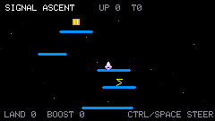

---

## Packet Catch

Move left and right to collect clean packets while avoiding corruption.

Higher tiers introduce armed corrupt emitters that stop, count down, and detonate.

Press **Enter** to release a cooldown **Signal Pulse**, clearing nearby corrupt packets and active emitters.

The run uses heart-style in-game Stability. Lose them all and the session ends.

**Core skill:** threat prioritization.

---

> **KEEPER TIP**  
> A bad Training run can still cost Energy, raise Stress, or cause damage. Check the Habitat afterward.

| Signal Drift | Signal Hopper |
| --- | --- |
| 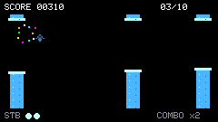 | 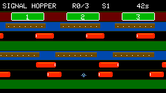 |

[Back to Contents](#contents)

---

<a id="relay-work"></a>

# Relay Work

Relay Work is the economy's safer counterpart to Venture.

Instead of risking the creature in dangerous territory, the Keeper performs short jobs for the relay network.

Work becomes available through progression and can expand as the creature matures.

Tasks are short: packet handling, sorting, timing, and other small signal jobs.

Relay Work pays Coins, but it has cooldowns. It is useful for covering food, medicine, and expedition costs.

If the Work screen says to come back later, the relay is not ready for another job yet.

> **FIELD NOTE**  
> Nobody has explained who owns the relay network. The shopkeeper does not answer this question.

[Back to Contents](#contents)

---

<a id="venture"></a>

# Venture

**Venture** is the gateway to Demonym's dangerous exploration systems.

The two major Venture activities are:

- **Roam**
- **Salvage**

Roam is a persistent expedition through a branching signal region.

Salvage is a shorter excavation-style search for material, junk, and Habitat Objects.

Both consume resources and can return rewards that are difficult to obtain safely at home.

Prepare before leaving.

A good Venture loadout begins with:

- enough Health
- enough Energy
- manageable Hunger
- manageable Stress
- useful healing
- room in Inventory.

[Back to Contents](#contents)

---

<a id="roam"></a>

# Roam

Roam sends the Demonym into a procedurally generated signal region.

The region is built from connected rooms, crossings, encounters, merchants, recovery spaces, rewards, and route obstacles.

Roam is not a single straight dungeon.

You may find:

- normal paths
- directional crossings
- combat rooms
- sentries
- elite enemies
- Wardens
- Relay Clinics
- merchants
- treasure
- Fragment sites
- brush caches
- neutral signals
- Augments
- keys and locked routes
- special encounter rooms.

The map records where you have been, but not every useful tool is available at the beginning of a run.

## Movement

Use the directional controls to move between valid room connections.

Some local spaces also require movement through the room itself.

Roam supports held movement where appropriate, but important encounters guard against instantly retriggering because a key remained held.

## Consequences persist

Damage, Hunger, resource use, rewards, and cleared encounters belong to the expedition.

Retreating from a fight is not the same as undoing it.

Extracting safely is not the same as abandoning.

[Back to Contents](#contents)

---

<a id="depths"></a>

# Depths

A completed Roam layer does not have to end the expedition.

At the appropriate exit, the Keeper may choose to **Extract** or **Descend**.

Descending begins a new, deeper procedural layer.

A deeper layer:

- rebuilds the route
- increases danger
- increases potential reward
- resets run-specific navigation knowledge such as local mapping
- asks whether the supplies you have left are worth risking.

Depth can continue beyond the first clear.

Your deepest successful depth is part of the creature's history.

### Why descend?

Because the best reward is rarely on the safest floor.

### Why extract?

Because an item in Inventory is more valuable than an item lost with a failed expedition.

> **KEEPER TIP**  
> Depth is a wager against your remaining condition. Do not evaluate it using Health alone. Hunger, Energy, healing stock, and Stress are part of the same decision.

[Back to Contents](#contents)

---

<a id="crossings"></a>

# Crossings & Rooms

Not every Roam tile is a menu prompt.

**Crossings** are local movement spaces that physically connect parts of the route.

They may be oriented horizontally or vertically, and their entrance/exit geometry matches the direction of travel.

Objects and entities inside a Crossing can continue moving while you are there. Reaching the far side is part of the encounter.

Some Crossings contain hazards or special events. Heat events are uncommon.

## Room archetypes

Roam uses room silhouettes and icons to communicate what kind of place you are entering.

Common archetypes include:

- combat
- elite combat
- Warden / boss
- clinic / recovery
- merchant
- treasure
- Fragment
- Augment
- gate / trial
- locked route
- key
- neutral signal
- cache.

Some rooms have obvious functions.

Others are better learned by entering them.

[Back to Contents](#contents)

---

<a id="navigation"></a>

# Navigation Tools & Extraction

A Roam run may provide several navigation tools.

## Route Map

The Map reveals the broader region view and makes route planning easier.

Without it, you still have immediate local information and visited-space memory, but not the complete overview.

## Compass

The Compass points generally toward the region exit.

It does **not** solve the route.

At a fork, the Compass tells you direction, not which sequence of rooms is safe.

## Relay Anchor

Relay Clinics can activate extraction points.

When standing on an activated Anchor, you can safely extract from the current expedition.

Safe extraction returns the creature to the Habitat while preserving the resumable expedition state.

When you return through Venture, the expedition can continue.

Temporary run-only pressure or Augment effects do not necessarily survive extraction.

## Portable Anchor

Portable expedition equipment can provide additional flexibility depending on the run and current item set.

## Abandoning a run

Abandoning is destructive.

Use it when you truly want to give up the expedition, not when you merely want to return to the Habitat for a while.

<!-- I still want to add a Roam screenshot with the Map, Compass and Anchor indicators visible. -->

[Back to Contents](#contents)

---

<a id="salvage"></a>

# Salvage

Salvage is a shorter Venture activity focused on reading a buried field.

The goal is to uncover useful material without destroying the excavation or exhausting the creature.

A Salvage attempt costs Energy.

The field contains ordinary material, useful finds, junk, and rarer object echoes.

You clear or inspect tiles, read the clues produced by the field, and decide where to spend the remaining **Salvage Stability**.

As the excavation becomes unstable, continuing becomes increasingly risky.

## Signals in the field

Salvage can communicate hints such as:

- **TRACE** - evidence that something useful may be nearby
- **OBJ ECHO** - a stronger indication that a Habitat Object may be present
- changing tile textures that show what has already been checked.

Do not just click every tile. Energy and Stability make each choice matter.

## What can be recovered?

Salvage can produce:

- Coins
- usable supplies
- junk
- rare Habitat Objects
- other Venture rewards.

Not every successful excavation produces a rare object.

Repeated bad luck is softened by the system, but rarity is still rarity.

> **KEEPER TIP**  
> Stop treating "nothing found" as "nothing learned." In Salvage, checked space is information.

<!-- I still want to add a Salvage screenshot with TRACE / OBJ ECHO visible. -->

[Back to Contents](#contents)

---

<a id="habitat-objects"></a>

# Habitat Objects & Junk

Some recovered objects are not consumables.

They belong in the Habitat.

Known examples include:

- **Broken Antenna**
- **Signal Lamp**
- **Dead Screen**
- **Crystal Node**
- **Tiny Fan**
- **Wire Nest**
- **Strange Statue**

Habitat Objects can be browsed separately from ordinary Inventory and displayed at a larger scale.

Their value is not always obvious from the name.

Some are decorative.

Some provoke creature behavior.

Some may be useful chiefly because of what they imply.

### Junk

Salvage can also return less prestigious material, including things like:

- Bent Spring
- Empty Casing
- Broken Key
- Unknown Screw

Junk may be sellable and can still contribute to the fiction of the world.

Do not expect every object to be a secret legendary weapon.

> **SIGNALPEDIA NOTE**  
> The recovered objects consistently suggest machinery larger than the Habitat. No corresponding intact machine has been documented.

[Back to Contents](#contents)

---

<a id="battle"></a>

# Battle

Battle is turn-based.

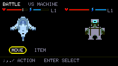

The creature and its opponent each choose actions, then the turn resolves with damage, status effects, passives, Energy costs, and animations.

A normal battle screen shows:

- both creatures
- Level
- Health
- Energy
- active status effects
- selected command information.

Battle is not built around one universal "Attack" stat.

The important concept is **Pressure**.

Each move applies a type of Pressure, and each creature responds differently to those types.

Read the move panel.

The game explicitly labels expected matchups as:

- **BONUS DAMAGE**
- **NORMAL**
- **REDUCED DAMAGE**

You do not need to memorize an invisible type chart before your first fight.

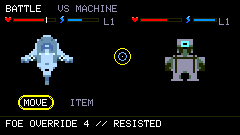

## Battle flow

A typical turn is:

```text
CHOOSE COMMAND
→ CHOOSE MOVE / GUARD / RETREAT / ITEM
→ OPPONENT CHOOSES
→ TURN RESOLVES
→ STATUS + PASSIVES RESOLVE
→ NEXT TURN
```

Some encounters add special rules, wild behavior, or Warden mechanics.

[Back to Contents](#contents)

---

<a id="pressures"></a>

# Pressures

Demonym uses five major battle Pressures:

| Pressure      | General Character                                 |
| ------------- | ------------------------------------------------- |
| **Force**     | impact, physical disruption, direct power         |
| **Signal**    | pulses, interference, transmission, disruption    |
| **Heat**      | thermal attacks, ignition, escalating burn        |
| **Corrosion** | contamination, degradation, wearing defenses down |
| **Echo**      | resonance, imitation, distortion, interference    |

A Lineage may naturally favor one Pressure, resist another, or have access to moves that cover a weakness.

Fragments, Adaptations, and Legacy can alter this picture.

### Effectiveness

When selecting a move, pay attention to the effectiveness label.

A stronger-looking move is not always the correct move if the opponent reduces that Pressure.

Similarly, a lower-cost move with Bonus Damage may outperform an expensive neutral attack.

> **KEEPER TIP**  
> Energy is part of damage. A move that empties your Energy bar has a cost even if it wins the current turn.

[Back to Contents](#contents)

---

<a id="status-effects"></a>

# Status Effects

Battle Pressures can produce secondary conditions.

Major status families include:

### Stagger

Associated with Force.

Disrupts an opponent's rhythm and can create an opening.

### Disruption

Associated with Signal.

Interferes with clean execution and signal stability.

### Burn

Associated with Heat.

Represents continuing thermal damage or pressure after the initial hit.

### Corrosion

Associated with Corrosion.

Degrades the target over time.

### Echo Interference

Associated with Echo.

Distorts or interferes with the target's normal signal behavior.

Exact move interactions vary.

The important rule is simple: a status effect is part of the move's value. Do not compare attacks by immediate damage alone.

[Back to Contents](#contents)

---

<a id="moves"></a>

# Moves, Guard & Retreat

## Moves

A Demonym's moveset is not identical across every creature.

Lineage, form, progression, Adaptations, and Legacy can all affect what becomes available.

The Stats → Moveset view shows equipped move information such as:

- move name
- slot
- Pressure
- short description
- Energy cost.

Locked or unavailable moves are visibly marked and cannot be used simply because the cursor can reach them.

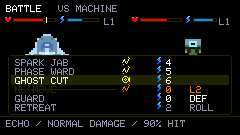

## Energy cost

Battle moves consume Energy.

If the creature cannot afford a move, it must choose something else.

This creates a second battle clock underneath Health: a creature can still be physically healthy while running out of tactical options.

## Guard

Guard is the reliable defensive action.

Use it when:

- the opponent is clearly building toward something dangerous
- your good move is temporarily unavailable
- you need to conserve Energy
- survival matters more than tempo.

## Retreat

Retreat tries to leave a battle when retreating is allowed.

Retreat can fail.

Repeated attempts still use turns, so failed retreats can be risky.

Some encounters, bosses, or special battles may restrict retreat.

Wild opponents may also flee on their own.

[Back to Contents](#contents)

---

<a id="experience"></a>

# Experience, Injury & Recovery

Winning battles contributes to creature progression.

Battle experience raises Level and supports the long-term growth of an Adult.

Deeper Roam runs and stronger opponents usually give better progression than repeating easy fights.

## Injury

Battle damage and other effects can still matter after the result screen.

A creature can leave combat hurt or injured.

Medical items, Rest, and Relay Clinics help recovery.

A Relay Clinic is especially valuable on a long expedition, but repeated visits are less powerful than the first major recovery. Do not treat one discovered Clinic as an infinite full-heal station.

## Defeat

Defeat does not always mean the entire game is over.

In Roam, a Warden defeat can send the creature back to the last safe location while leaving the Warden uncleared.

The run continues only if you still have the resources to make another attempt.

> **KEEPER TIP**  
> The question after a defeat is not "Can I fight again?"  
> It is "What changed because I fought?"

[Back to Contents](#contents)

---

<a id="fragments"></a>

# Fragments & Adaptations

Fragments are pieces of signal identity recovered from encounters, exploration, and other organisms.

They are not ordinary stackable crafting ingredients.

A discovered Fragment becomes part of the creature's known biological/signal vocabulary.

## Fragments

Fragments may:

- belong naturally to certain Lineages
- correspond to battle Pressures
- contribute to Adaptations
- be exchanged with another Keeper
- become relevant to Signal Legacy.

Unknown Fragments hide their deeper details until discovered.

Finding the same discovery again may give a smaller material reward instead of another new entry.

## Adaptations

Adaptations are larger traits gained through development and discoveries.

They can affect:

- stats
- Pressure affinities
- passives
- appearance
- tactical options.

Adaptations are limited so they do not replace the creature's main Lineage identity.

## Purity and compatibility

Legacy records can remember the quality of important Fragments.

Archived Fragment quality may be described as:

- **FAINT**
- **STABLE**
- **PURE**

Compatibility with a future creature may be shown as:

- **NATIVE**
- **COMPATIBLE**
- **UNSTABLE**
- **REJECTED**

A powerful inheritance is not automatically a compatible inheritance.

[Back to Contents](#contents)

---

<a id="connect"></a>

# Connect

Two Cardputer ADV devices running compatible Demonym builds can communicate directly through **Connect**.

No Internet connection, account, or server is required for a local session.

Open Connect on both devices and allow them to discover one another.

The link exchanges only the public information needed for the session. A linked creature can be inspected, battled, and used for peaceful exchange without turning the Cardputer into a general-purpose Wi-Fi scanner.

Demonym's ordinary world systems do not depend on nearby access points, GPS, or always-on wireless ecology.

Connect is the place where the radio becomes part of play.

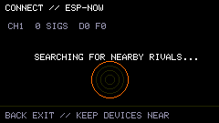

[Back to Contents](#contents)

---

<a id="connect-options"></a>

# Battle, Exchange & Details

After a verified nearby creature is selected, Connect provides three primary choices.

## Battle

Begin a direct creature-versus-creature match.

Linked battles use the same visible battle language as normal combat:

- Health
- Energy
- moves
- Pressures
- status effects
- Guard
- battle animations.

If the other Keeper is still choosing, the game waits.

Both devices verify the same turn result.

Linked battles are designed for competition, not resource farming, so ordinary single-player reward payouts are limited or absent.

## Exchange

Offer compatible exchangeable material to the other Keeper.

Fragment exchange is peaceful. Both devices verify the session before applying the result.

Not every local item or Habitat tool can be traded.

## Details

Inspect the nearby Demonym's public information before deciding what to do.

This can include identity, Lineage/form, Level, and other basic battle information.

Private save data is not exposed just because another Cardputer is nearby.

[Back to Contents](#contents)

---

<a id="rivals"></a>

# Rivals, Reactions & Chat

Demonym remembers repeated encounters.

A known opponent can become more than a nameless device on the discovery screen.

The **Rival Book** can preserve information such as:

- rival identity
- Lineage / form
- encounter count
- verified sessions
- local win/loss/draw history
- Fragment-sharing history.

Repeated opponents may be presented as familiar rivals or more serious long-term nemeses.

## Quick reactions

During supported linked battle moments, short reactions can be sent without typing a full message.

Examples include:

- `NICE`
- `...`
- `AGAIN?`
- `GOOD FIGHT`

## Chat

Press **C** during a verified linked battle to open the compact session chat.

Chat is very small and only meant for quick messages during a link session.

Type a short message, send it, return to the fight.

The conversation exists to make two Cardputers feel like two people are actually standing there with strange little organisms in their hands.

[Back to Contents](#contents)

---

<a id="signalpedia"></a>

# Signalpedia

The **Signalpedia** is the game's in-world field record.

It is not a complete strategy guide provided at installation.

It fills as the Keeper discovers organisms, forms, Fragments, Adaptations, and other signal information.

Entries can include multiple detail pages.

Unknown material remains obscured until legitimately discovered.

Signalpedia discoveries stay with the installation even after the active creature is replaced.

That makes it one of the clearest records of how much of Demonym's world you have actually seen.

> **SIGNALPEDIA NOTE**  
> A blank entry is not missing documentation. It is an invitation.

| Signalpedia | Signalpedia detail |
| --- | --- |
| 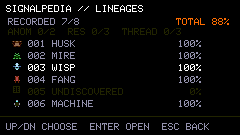 | 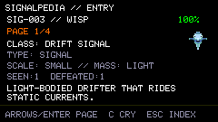 |

[Back to Contents](#contents)

---

<a id="lineages"></a>

# Lineages

Eight broad Lineages are known.

A Lineage is the creature's main biological/signal family. It is not something you pick from a character-select screen.

Each Lineage has its own visual language, natural Pressure relationships, passives, and adult possibilities.

## Husk

Armored, heavy, defensive.

Husk organisms tend toward reinforcement, impact tolerance, and Force-oriented behavior.

They often look as though their bodies were built to survive being struck.

## Mire

Regenerative, contaminating, persistent.

Mire organisms tend toward Corrosion, recovery, parasitic or symbiotic traits, and uncomfortable biological resilience.

## Wisp

Evasive, perceptive, unstable.

Wisp organisms are strongly associated with signal behavior, quick adaptation, and forms that can diverge dramatically during development.

Known Wisp adult tendencies include **Pale**, **Static**, and **Feral** expressions.

## Fang

Aggressive, mobile, direct.

Fang organisms favor pursuit, momentum, and decisive attacks.

Their care needs can reflect the same intensity.

## Choir

Resonant, social, imitative.

Choir organisms are associated with Echo behavior, status manipulation, response, and the strange value of being observed by another signal.

## Machine

Calculated, modular, efficient.

Machine organisms favor reliable systems, engineered-looking structures, and adaptations that feel assembled as much as grown.

## Cinder

Thermal, volatile, persistent.

Cinder organisms are associated with Heat, ignition, and bodies that suggest containment is an ongoing problem.

## Veil

Obscured, deceptive, difficult to read.

Veil organisms favor misdirection, interference, and forms whose boundaries do not always look stable.

### Adult forms

Each Lineage can produce multiple Adult forms.

This manual does not list every Adult form or the exact evolution formulas.

You are raising a creature, not picking an exact build from a menu.

[Back to Contents](#contents)

---

<a id="signal-legacy"></a>

# Signal Legacy

An Adult's greatest reward is not a final Level.

It is the ability to matter to what comes next.

**Signal Legacy** records important parts of a completed life and allows a future generation to inherit a controlled echo of them.

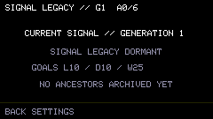

Legacy is not a full clone.

The next creature is still its own creature.

Current Legacy categories can include:

### Instinct Echo

Carries forward a behavioral or performance tendency.

### Adaptation Tendency

Biases the next generation toward an inherited adaptation theme without simply copying the old creature wholesale.

### Move Memory

Carries an echo of battle knowledge into the next generation.

### Physical Echo

Allows part of an ancestor's visual identity to reappear.

### Temperament

Passes forward a personality bias.

### Eco Memory

Carries a broad environmental/carrying tendency recorded by the ancestor.

A Legacy choice is a direction, not a guarantee.

The point is continuity without removing surprise.

## What makes a good Legacy?

A creature with more history usually leaves a better Legacy.

Time active, difficult victories, important discoveries, stable Fragments, installed traits, deep exploration, and other accomplishments can make an ancestor more valuable to the lineage archive.

A creature that simply existed and a creature that survived a long, eventful life should not leave identical records.

[Back to Contents](#contents)

---

<a id="echo-eggs"></a>

# Echo Eggs & New Generations

When an Adult reaches a normal end-of-generation point, Demonym can create an **Echo Egg**.

Before the next life starts, you can review the available Legacy choices and pick the kind of echo you want to pass forward.

The next Egg is generated before the inheritance is applied.

This matters.

Legacy influences the new creature; it does not let the Keeper simply select the exact Lineage, exact Adult form, exact stats, and exact moves from a menu.

The new organism is still new.

## The lineage loop

```text
RAISE
→ SURVIVE
→ DISCOVER
→ MATURE
→ LEAVE A RECORD
→ BIND AN ECHO
→ HATCH AGAIN
```

Some endings do not produce a Legacy opportunity.

Some bad endings do not give the same Legacy options as a normal completed generation.

Signal Legacy rewards a creature with real history. It is not a free bonus after every ending.

> **FIELD NOTE**  
> The Egg is never identical to the ancestor.  
> The Egg sometimes knows things it was not taught.

[Back to Contents](#contents)

---

<a id="motion"></a>

# Motion & Carrying

The Cardputer has a motion sensor, and Demonym can use general movement history as part of the creature's record.

The inherited effect is kept small.

Demonym does not need to know your exact route through the world.

It can notice broad patterns such as:

- long periods of stillness
- regular carrying
- repeated movement
- travel-like activity
- restless motion.

Motion history can contribute to ecological tendencies and Legacy.

Known ecological inheritance themes include ideas such as:

- **Stillwater** - calm, stationary history
- **Wayfinder** - travel and carrying history
- **Emberwake** - restless, active movement history.

The game does **not** require passive GPS tracking or constant scanning of nearby Wi-Fi networks to create this effect.

The Cardputer itself is enough.

[Back to Contents](#contents)

---

<a id="saving"></a>

# Saving & Power

Demonym saves progression automatically at important moments and also maintains fallback save behavior.

Meaningful events such as hatch, evolution, Training results, battle results, Roam checkpoints, extraction, Fragment rewards, and generation transitions are treated as important save points.

The goal is simple:

You should not need to manually save every time you feed the creature.

## Turning the device off

Normal power-off pauses most active-time simulation. You do not need to leave the Cardputer running all night.

Demonym is a portable persistent game, not an obligation to keep hardware powered forever.

When possible, leave major transitions enough time to finish their visible save/transition sequence before hard power removal.

## Save maintenance

Development builds may expose additional diagnostics or maintenance actions. Those are not part of ordinary play and are not required to understand the game.

[Back to Contents](#contents)

---

<a id="keeper-tips"></a>

# Keeper Tips

### 1. Feed before heavy healing

Hunger limits recovery. If medicine appears weaker than expected, inspect Hunger.

### 2. Energy is a budget

Training, Salvage, Roam, and battle all compete for the same creature.

Do not empty the Energy bar just because one more activity is available.

### 3. Stress is history, not just a warning

High Stress can be the result of a play style. Reducing it is useful, but the fact that it became high can still have helped shape the creature.

### 4. Train broadly

Each Training program has its own difficulty tier. You do not need to grind one game forever.

### 5. Winning is not always clean

A high Training score with repeated collisions can still hurt.

A battle victory can still leave Injury.

A deep Roam run can still be a bad expedition if you cannot extract.

### 6. Use Clinics intelligently

A Clinic is valuable, but repeated recovery is weaker than the first visit. It is not an infinite loophole.

### 7. Do not descend automatically

Depth exists to tempt you.

Look at Health, Energy, Hunger, Stress, medicine, and route tools before going deeper.

### 8. Extract is not abandon

If you have an active Anchor, safe extraction can preserve a resumable expedition.

### 9. Read move effectiveness

**BONUS DAMAGE** and **REDUCED DAMAGE** are more useful than guessing from move names.

### 10. Guard is a move

Conserving Energy or surviving a dangerous turn can be more important than attacking.

### 11. Retreat early

Waiting until one hit from defeat makes retreat much less attractive.

### 12. Keep strange objects for a while

The Shop will buy many things.

That does not mean the Shop knows what they are for.

### 13. Check Signalpedia after discoveries

A new Signalpedia entry may explain more than the original pickup message.

### 14. Play against the same Keeper more than once

The Rival Book gets more useful once you start seeing the same opponents again.

### 15. Legacy is the real long game

Levels belong to one creature.

A lineage belongs to the Keeper.

[Back to Contents](#contents)

---

<a id="glossary"></a>

# Glossary

**Adaptation**  
A larger creature trait that can affect appearance, stats, Pressure behavior, or passives.

**Adult**  
The mature life stage. Adults have access to the broadest progression, Venture, battle, Connect, and Legacy systems.

**Anchor / Relay Anchor**  
A Roam extraction point activated through expedition progress.

**Battle Pressure**  
One of the five major combat families: Force, Signal, Heat, Corrosion, Echo.

**Connect**  
Direct Cardputer-to-Cardputer interaction for verified nearby Demonym sessions.

**Crossing**  
A local movement room inside Roam that physically connects parts of a route.

**Demonym**  
The creature being raised; also the name of the game/firmware.

**Depth**  
A deeper procedural Roam layer reached by descending after completing the current one.

**Echo Egg**  
A new-generation Egg created after a completed Legacy transition.

**Energy**  
The resource spent on demanding activity and battle moves.

**Extract**  
Safely leave a Roam expedition from a valid extraction point while preserving resumable progress.

**Fragment**  
Discovered signal/biological material associated with Lineages, Pressures, Adaptations, exchange, and Legacy.

**Habitat**  
The Cardputer as the creature's home environment and the game's primary screen.

**Habitat Object**  
A recovered object that stays in the Habitat instead of being used like food or medicine.

**Health**  
Physical condition.

**Hunger**  
Nutritional need. Higher Hunger is worse and reduces maximum recoverable Health.

**Juvenile**  
The post-hatch developmental stage.

**Keeper**  
The player.

**Legacy**  
The ancestral record and inheritance system that allows a future generation to receive echoes of a previous life.

**Lineage**  
The creature's broad biological/signal family: Husk, Mire, Wisp, Fang, Choir, Machine, Cinder, or Veil.

**Pressure**  
The type of force a battle move applies.

**Relay Clinic**  
A Roam recovery site that can also activate an extraction Anchor.

**Relay Work**  
Short low-risk jobs used to earn Coins.

**Resonance**  
A progression concept tied to Training and the creature's development/history.

**Rival Book**  
Persistent record of known nearby Keepers and linked encounters.

**Roam**  
A persistent procedural Venture expedition through rooms, encounters, tools, and Depths.

**Salvage**  
A Venture excavation activity that trades Energy and Salvage Stability for recovered material.

**Salvage Stability**  
The excavation's remaining safe working margin.

**Signal Legacy**  
The system used to choose what kind of ancestral echo can influence a future Egg.

**Signalpedia**  
The persistent in-world encyclopedia filled through discovery.

**Stress**  
Accumulated psychological/biological strain.

**Venture**  
The menu/category containing dangerous exploration activities such as Roam and Salvage.

**Warden**  
A major Roam enemy that blocks progression.

[Back to Contents](#contents)

---

<a id="field-notes"></a>

# Field Notes

> **FIELD NOTE // 001**  
> The organisms do not appear to distinguish between shelter and machine.  
> To them, the Habitat _is_ the world.

---

> **FIELD NOTE // 002**  
> Recovered fragments contain recognizable structural patterns despite having no agreed physical medium.  
> The term "gene" remains convenient and probably inaccurate.

---

> **FIELD NOTE // 003**  
> Adult organisms respond to other Habitats faster than they respond to ordinary radio noise.  
> This behavior persists even in Lineages with no obvious sensory anatomy.

---

> **FIELD NOTE // 004**  
> Roam regions are internally consistent enough to map and unstable enough to regenerate.  
> Both observations are true.

---

> **FIELD NOTE // 005**  
> Habitat Objects are not all debris.  
> Several look like they were placed there before being recovered.

---

> **FIELD NOTE // 006**  
> Legacy transfer does not reproduce a creature.  
> It reproduces preference.

---

> **FIELD NOTE // 007**  
> The oldest reliable Keeper records begin with Eggs.  
> No reliable record explains where the first Egg came from.

---

## End of Manual

The Signalpedia contains what you have discovered.

The Habitat contains what you are responsible for.

Everything else is outside.

**Good luck, Keeper.**
